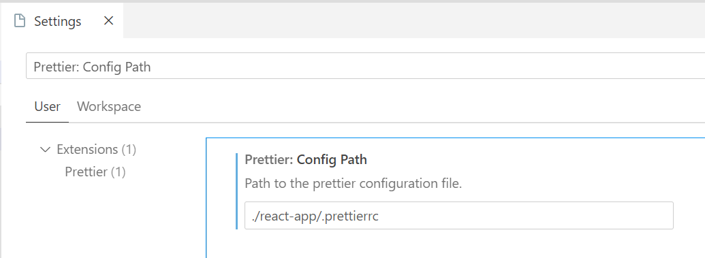

# Немного важной информации про скрипты и запуск проекта

Перед тем как запускать проект, необходимо перейти в папку с react приложением
и установить все зависимости

```powershell
cd react-app
npm install
```

или что я больше рекомендую, это глобально установить пакетный менеджер [yarn](https://yarnpkg.com/).
Он более безопасный, быстрый и вообще лучше, чем npm

```powershell
cd react-app
npm install yarn -g
yarn install
```

---

## Скрипты

### `npm start`

Запускает приложение в режиме разработки.\
Откройте [http://localhost:3000](http://localhost:3000) для просмотра в браузере.

Страница перезагрузится, если вы внесете изменения.\
Вы также увидите все ошибки ESLint в консоли.

### `npm test`

Запускает все тесты в проекте (когда мы их напишем)

### `npm build`

Собирает все файлы в минимизированные HTML/CSS/JS, чтобы залить их на сервер.

---

## Линтинг

ESLint — это утилита, которая может анализировать написанный код. Фактически, это статический анализатор кода, и он
может находить синтаксические ошибки, баги или неточности форматирования.

Чтобы линтер работал не только по скрипту, его нужно подключить в среде разработки.

### Web Storm

В WebStorm просто в настройках ищем вкладку ESLint и подключаем конфиг проекта.

### VSCode

В VSCode следуем этому
[гайду](https://dev.to/eprikhodko/eslint-prettier-vs-code-create-react-app-airbnb-52bc),
только пропускаем все шаги с конфигурацией. Просто
используем тот конфиг, который уже есть в проекте.

- [немного про линтер](https://tproger.ru/translations/setting-up-eslint-and-prettier/)
- [Официальная документация](https://eslint.org/)

### `npm run lint`

Запустить линтер по всему проекту.

### `npm run lint:fix`

Запустить линтер по всему проекту и применить автоматические фиксы.
Очень рекомендую периодически прогонять этот скрипт.

---

## Форматтер

Prettier – инструмент для автоформатирования кода с поддержкой кучи инструментов, включая наши любимые Angular и
Typescript. Он не модифицирует код, не заменяет тернарные операторы на if’ы и не разбивает длинные строки на несколько
конкатенированных (об этом уже должен думать разработчик), а просто выводит то, что есть, с нужным форматированием.

### Web Storm

В WebStorm просто в настройках ищем вкладку Prettier и подключаем конфиг проекта.

### VSCode

В VSCode у вас должен быть установлен
плагин [prettier](https://marketplace.visualstudio.com/items?itemName=esbenp.prettier-vscode)
Плагин должен сам подтянуть
конфиг, но если этого не произошло, то просто в настройках ищем `Prettier: config Path`
и вбиваем туда `./react-app/.prettierrc`


Официальная документация: https://prettier.io/

### `npm run prettier:fix`

Форматировать все файлы проекты Prettier'ом

---
## Контакты
Если остались вопросы, пишите в [мне](https://t.me/KatasonovYP) в телегу

